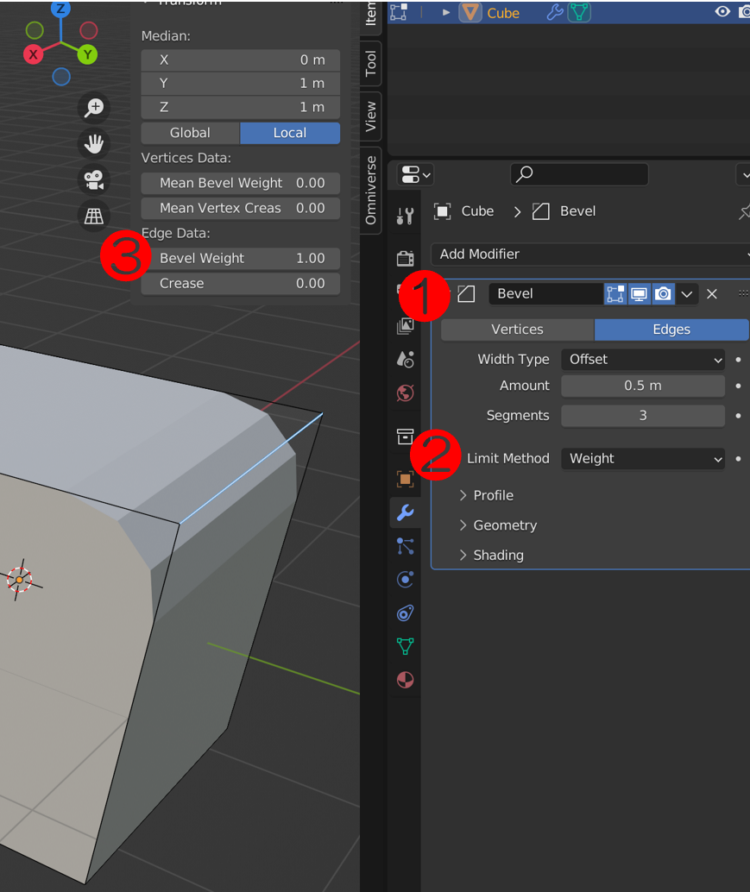

Bevel modifier: control which edges it applies to
====

#. Add Bevel modifier
#. Set ``Limit method = Weight`` (the modifier effect will disappear)
#. Edit mode
    - Select all edges that need the bevel
    - ``Bevel weight = 1.0``

