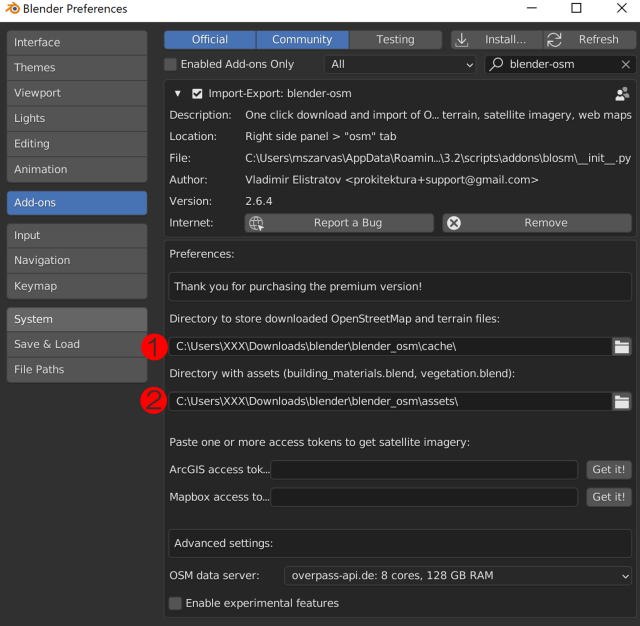

Blender OSM
===========

Use
---

#. Access via Side-panel (N key) > osm
#. Select the geographical area to cover
   
   * ``Extent > select``
   * configure via the web-map that pops up
   * Press ``Copy`` on the web-page
   * Press ``Extent > paste`` in OSM plugin side panel

#. Download terrain first (only if needed; buildings do not work well with terrain)
#. Download image overlay (satellite or map) next

   * ``Settings > Overlay: Custom URL``
   * ``Overlay URL:``

      * ``http://mt.google.com/vt/lyrs=m&x={x}&y={y}&z={z}`` for Google Satellite
      * ``http://mt.google.com/vt/lyrs=m&x={x}&y={y}&z={z}`` for Google standard map
      * ``http://mt.google.com/vt/lyrs=t&x={x}&y={y}&z={z}`` for Google terrain
      * ``http://tile.openstreetmap.org/{z}/{x}/{y}.png`` for OSM Mapnik

#. Download OSM buildings last

   * Select ``OpenStreetMap`` from the dropdown
   * Select ``2D`` for use with Bulidify
   * Select ``Import buildings`` *only*
   * Select ``Import as single object`` for use with Buildify (can separate buildings after import, will not work properly if importing as separate buildings)
   * ``File:`` select pathname of Blender file that includes the Buildify node-graph
   * ``Name:`` select building; this is the name of geometry node inside the blender file
   * Press ``Import``

Download
--------
* Free version: https://prochitecture.gumroad.com/l/blender-osm
* Premium version: https://prochitecture.gumroad.com/l/blosm

Documentation
-------------
* Free version: https://github.com/vvoovv/blender-osm/wiki/Documentation
* Premium version: https://prochitecture.gumroad.com/l/blosm

Install
-------
* Set up map data cache directory: blender_osm/cache
* Set up assets directory: blender_osm/assets
* Unzip contents of assets.zip to become blender_osm/assets
* ArcGIS and Mapbox are not needed (satellite image quality subpar)

